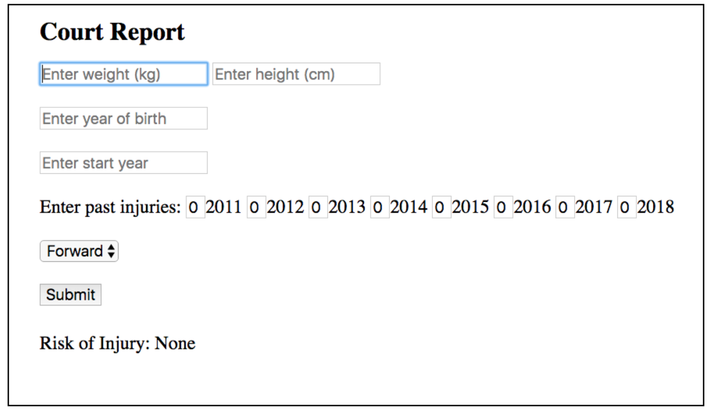
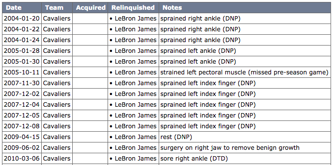
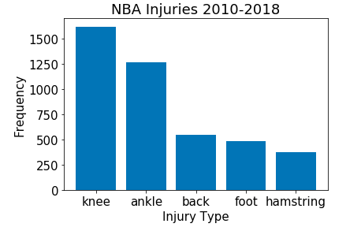
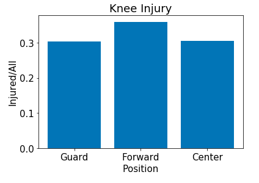
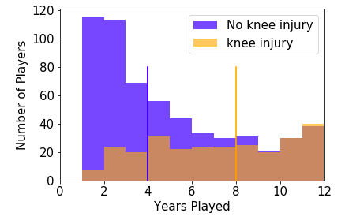
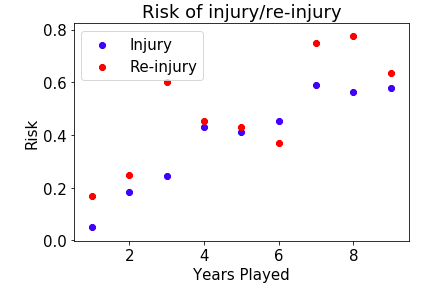
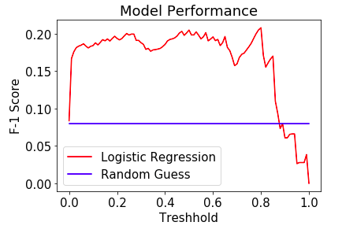

# Predicting NBA Knee Injuries 
At Insight, I built a simple web app for predicting knee injuries in NBA. The app can be found online at: https://court-report.herokuapp.com/

## Use Case 
Injuries significantly lower a team's odds of success. Assume you are an NBA team manager and you have a tool that predicts the risk of injury of your players. Now, you can prepare for worst case scenarios by training backups for players at high risk of injury. You also have the option to not to hire a player who is at high risk of injury. 

Such a tool does not exist. At least it is not publicly available. I decided to make an attaempt at building such a tool. The figure below shows the first iteration of this ML based product:

This product is focused on knee injuries only as they are the injuries that happen with the highest frequency. For example, consider a player who weighs 100 Kg, his height is 200 cm, is born in 1990, started his career in 2015, playes the guard position and experinced one knee injury in 2016. The risk of another knee injury in 2020 for this player is 17%. One way to make sense out of this number is to run it for all of the players, then rank the players from highest to lowest risk and prioretize attention to the players with the highest risk of injury. 

## Data Collection
In order to build this product, I scarrped data from NBA databases. First, I collected all the injury reports from 2010 to 2018 from "prosportstransactions.com". Here is an example of an injury report: 

I also collected data such as weight, height, date of birth, start year of career, end year of career and position on all the players who played within 2010 and 2018 timespan (~ 1000 players). Below is an example of that: 

I cleaned these two datasets and joined them so I could analyze the data. 

## Data Analysis 

The most frequent injury in NBA is knee injury. 

Forwards are at a higher risk of knee injuries than the players who play other positions. 

One important feature that I engineered is the "total years played". It turns out that the median injured player has played four years longer than the median uninjured player. 

In addition, the history of the past injuries matter. The risk of re-injury is consistently higher than the risk of injury. If you get injured once, you are more likely to get injured again. 

## Modeling
I used logistic regression to predict the risk of knee injury. It is a great option for binary classification (injured vs uninjured) and it outputs the probablity of belonging to each class. Each year the number of uninjured players were approximately 20 times the number of injured players. I upsampled the minority class to balance the dataset. Below is a simple demonstration of how the model works:

I decided to use F-1 score as the success metric since we need to minimize both false positives and false negatives. The figure below shows that at the optimal treshhold, the logistic regression model performs 2.5x better than random guess. I would call this a great start! 

## Code

The code is presented in the following jupyter notebook: NBA_injuries_prediction.ipynb 

